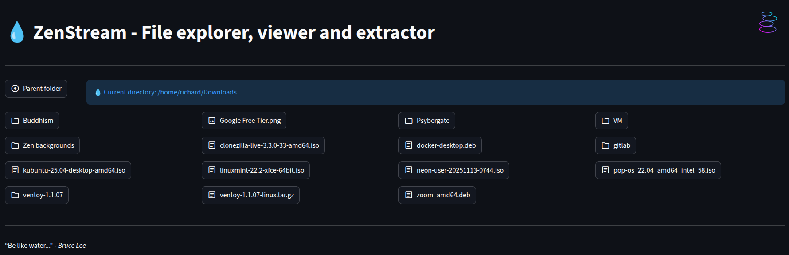
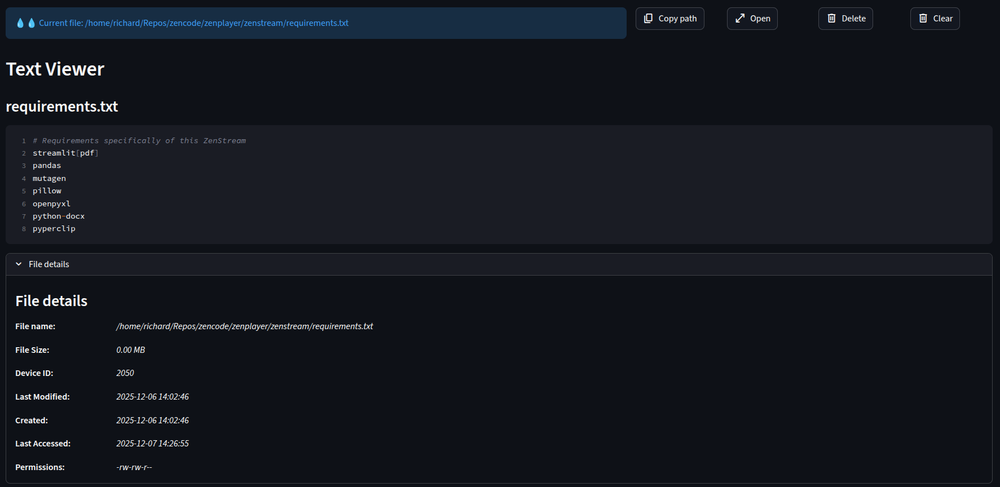
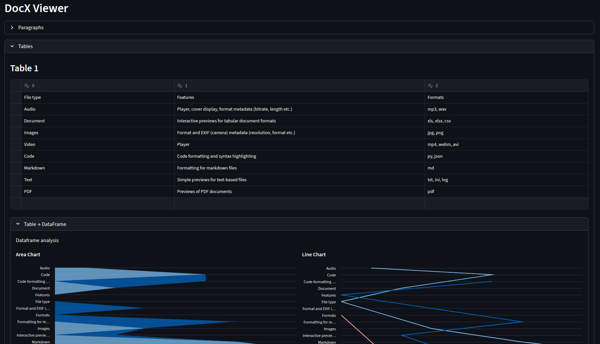
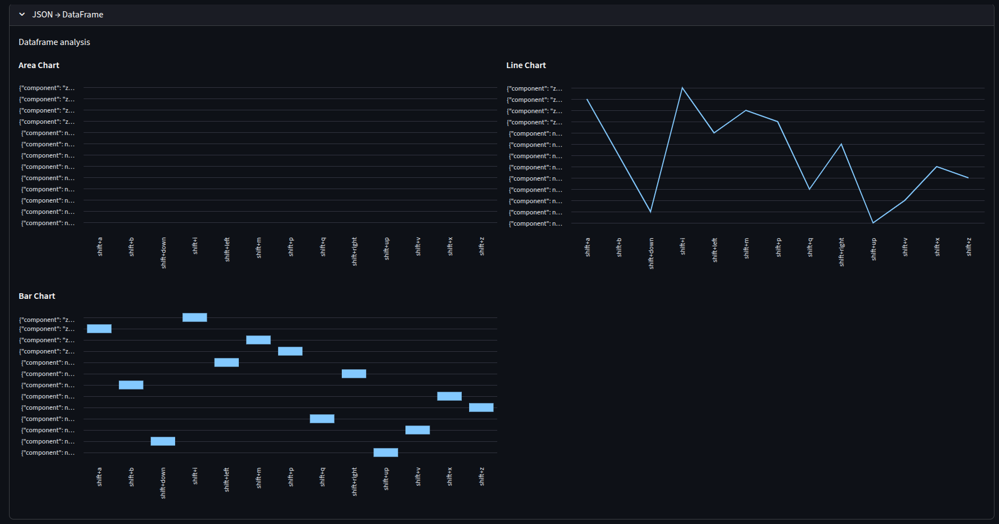
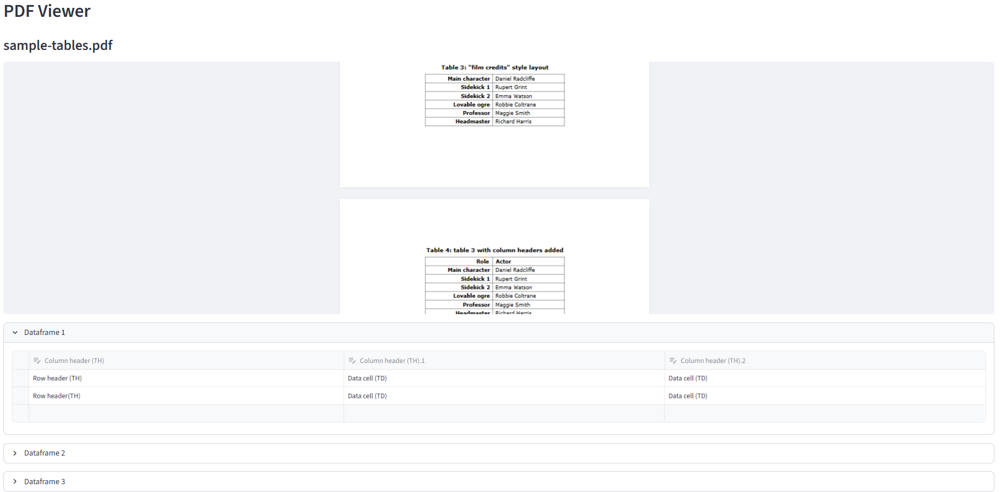

# ZenStream


```"Be like water making its way through cracks."``` - *Bruce Lee*


## Introduction

ZenStream is a browser-based file explorer, viewer, analyzer, visualizer and extractor. Think of it as a live, code-able dashboard over your file system.

## Flow

We try to flow through our files, without the context switching of the monkey mind, looking at, analyzing and thinking about our data.

💧

| Folder -> | File - > | Extract -> | Visualize |
|--------|----------|----------------|----------|
|||||
|||||


## Features

| File type | Features | Formats |
|-----------|----------|---------|
| Audio | Player, cover display, format metadata extraction (bitrate, length etc.) | mp3, wav |
| Data | Interactive preview and editing of tabular data |
|      | Export to csv option|
|      | Data visualization with line, bar and area charts | csv, docx, xlsx |
| Images | Format and EXIF (camera) metadata (resolution, format etc.)  | jpg, png |
| Video | Player | mp4, webm, avi |
| Code | Code formatting and syntax highlighting | py, json, sh, yml, yaml, bat, ipynb |
| Markdown | Rendering of markdown files | md |
| Text | Simple previews for text-based files | txt, ini, log |
| PDF | Previews of PDF documents | pdf |

## Installation

Assuming you have setup a Python virtual environment and have downloaded the code:
```bash
pip install -r requirement.txt
streamlit run main.py
```

## Design

TODO

## Licensing

ZenStream is a free, Open Source application shared under the MIT license.
